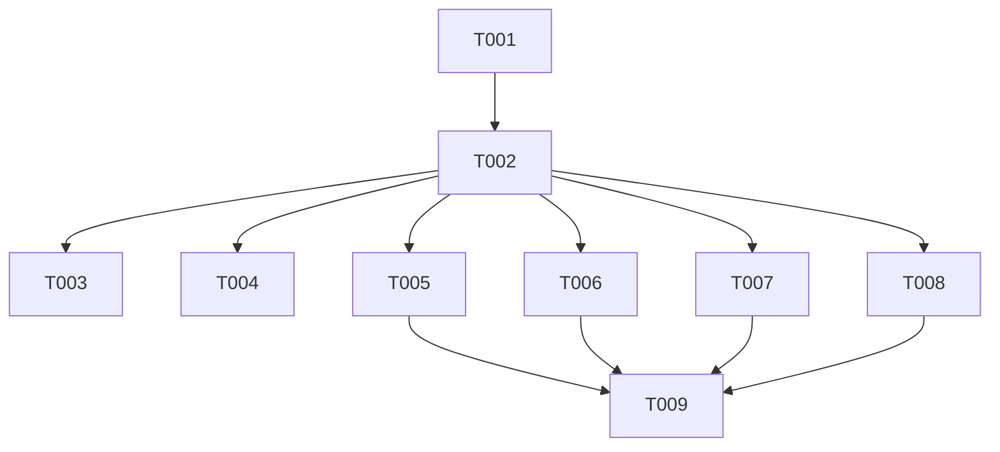

# Tasks: Anti-Bloat Constitution Amendments

**Feature**: 002-anti-bloat-constitution
**Generated**: 2026-02-22

## Overview

This feature documents architectural anti-patterns and proposes constitutional amendments to prevent future bloat. This is primarily a governance/documentation feature - the "implementation" is updating the constitution document.

## Task Count

- **Total Tasks**: 9
- **Setup Phase**: 1 task
- **Foundational Phase**: 1 task
- **User Story 1**: 2 tasks
- **User Story 2**: 3 tasks
- **User Story 3**: 1 task
- **Polish Phase**: 1 task

## Phase 1: Setup

- [x] T001 Review existing `.specify/memory/constitution.md` and note current version number

## Phase 2: Foundational

- [x] T002 Verify all proposed amendments from spec.md Appendix B are ready for integration

## Phase 3: User Story 1 - Document Architectural Anti-Patterns (P1)

**Goal**: Anti-patterns are documented in spec.md and accessible to all developers

**Independent Test**: Can verify anti-patterns listed in Appendix A of spec.md

- [x] T003 [P] [US1] Finalize spec.md Appendix A - Remove strikethrough formatting, clean up anti-pattern list
- [x] T004 [US1] Move finalized anti-pattern documentation to `.specify/memory/anti-patterns.md` as reference

## Phase 4: User Story 2 - Propose Constitutional Amendments (P1)

**Goal**: Constitutional amendments are integrated into `.specify/memory/constitution.md`

**Independent Test**: Amendments appear as new principles VIII-XIII in constitution

- [x] T005 [P] [US2] Add Principle VIII (Component Size Limits) to constitution
- [x] T006 [P] [US2] Add Principle IX (Type Safety Enforcement) to constitution  
- [x] T007 [P] [US2] Add Principles X-XIII (Duplication, Performance, Context, Health Gates) to constitution

## Phase 5: User Story 3 - Establish Code Health Gates (P2)

**Goal**: Automated enforcement of constitutional rules

**Independent Test**: CI pipeline includes code health checks

- [x] T008 [P] [US3] Update quickstart.md with ESLint configuration for new rules

## Phase 6: Polish

- [x] T009 Update constitution version from 1.2.0 to 1.3.0 with sync impact report

## Dependencies

## Parallel Execution

The following tasks can run in parallel after T002:
- T003, T004, T005, T006, T007, T008 - All are independent governance/documentation tasks

## Implementation Strategy

### MVP Scope (User Story 1 + 2)

The MVP is completing User Stories 1 and 2:
- Anti-patterns documented and accessible
- Constitutional amendments integrated

### Incremental Delivery

1. **Increment 1** (T001-T004): Clean up and publish anti-pattern documentation
2. **Increment 2** (T005-T007): Add new principles to constitution  
3. **Increment 3** (T008-T009): Polish and finalize version update

## Notes

- This is a governance feature - no source code changes
- Tasks are primarily documentation updates
- No tests required for governance changes
- ESLint configuration is optional (quickstart.md provides guidance)
