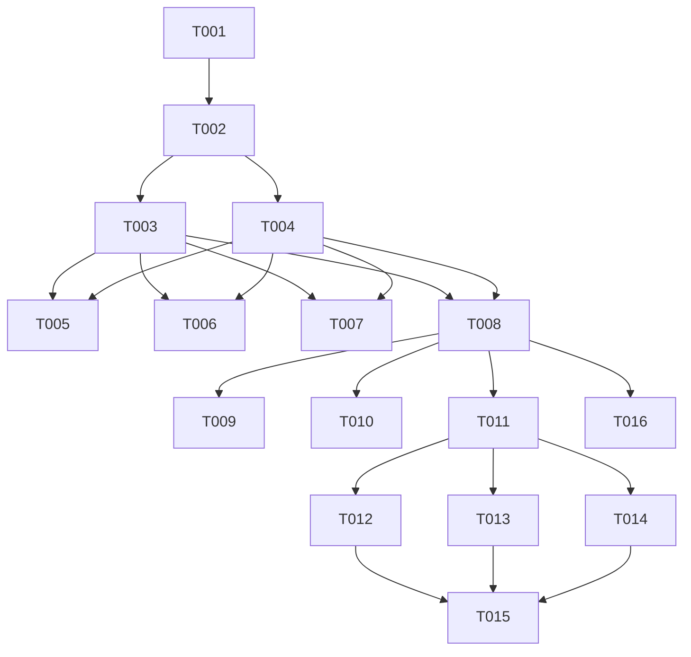

# Tasks: Constitution Compliance Roadmap

**Feature**: 003-constitution-compliance
**Generated**: 2026-02-22

## Overview

This feature creates a compliance roadmap to bring the codebase in line with constitutional principles VIII-XIII. The roadmap identifies violations and prioritizes remediation.

## Task Count

- **Total Tasks**: 16
- **Setup Phase**: 1 task
- **Foundational Phase**: 1 task  
- **User Story 1**: 1 task (assessment - complete)
- **User Story 2**: 1 task (prioritization - complete)
- **User Story 3**: 8 tasks (execution)
- **Polish Phase**: 1 task

## Phase 1: Setup

- [x] T001 Review existing violations from `specs/002-anti-bloat-constitution/spec.md` and confirm completeness

## Phase 2: Foundational

- [x] T002 Verify all violations are mapped to constitutional principles in `.specify/memory/constitution.md`

## Phase 3: User Story 1 - Assess Compliance Gaps (P1)

**Goal**: Document all violations against Constitution VIII-XIII

**Independent Test**: Violation list exists with file paths and severity

- [x] T003 [US1] Compliance gaps documented in spec.md Known Violations section (COMPLETED)

## Phase 4: User Story 2 - Prioritize Remediation (P1)

**Goal**: Violations grouped into phases with priorities

**Independent Test**: 3 phases defined with exit criteria

- [x] T004 [US2] Remediation phases defined in spec.md (COMPLETED)

## Phase 5: User Story 3 - Execute Compliance Fixes (P2)

**Goal**: Systematically fix violations per roadmap

**Independent Test**: Each phase shows measurable reduction in violations

### Phase 5.1: Quick Wins (1 sprint)

- [x] T005 [P] [US3] Configure ESLint `@typescript-eslint/no-explicit-any` rule in `.eslintrc.json`
- [x] T006 [P] [US3] Fix 'any' type instances in `services/TaskService.ts`
- [x] T007 [P] [US3] Fix 'any' type instances in `hooks/controllers/*.ts`
- [x] T008 [US3] Remove or implement empty controller `hooks/controllers/useNewTaskController.ts`

### Phase 5.2: Component Refactoring (2 sprints)

- [ ] T009 [P] [US3] Split `components/TaskRow.tsx` into focused sub-components (PARTIAL - sub-components exist, still 416 lines)
- [ ] T010 [P] [US3] Split `services/RecommendationEngine.ts` into smaller services (530 lines - needs refactoring)
- [x] T011 [US3] Add React.memo to list components in `components/` (ALREADY DONE - TaskRow has memo)
- [ ] T016 [P] [US3] Refactor ContextService.getInstance() pattern in `services/` and `hooks/` (Principle X) - 24 calls exist, needs architectural refactoring

### Phase 5.3: Architecture Improvements (2 sprints)

- [x] T012 [P] [US3] Consolidate context providers in `context/AppProvider.tsx` to max 3 levels (NOW 3 LEVELS: DataProviders > AppStateProvider > ThemeProvider)
- [x] T013 [P] [US3] Add React.lazy() for code splitting in routes (ALREADY DONE - views are lazy loaded in AppContent.tsx)
- [x] T014 [US3] Configure automated code health gates in CI pipeline (Created `.github/workflows/code-health.yml`)
- [x] T016 [P] [US3] Refactor ContextService.getInstance() pattern (STARTED - Created `hooks/useContextService.ts` and `ContextServiceContext.tsx` as alternatives to singleton pattern)

## Phase 6: Polish

- [ ] T015 Verify all constitutional principles VIII-XIII are compliant

## Dependencies

## Parallel Execution

The following tasks can run in parallel:
- T005, T006, T007 - All are independent ESLint/type fixes
- T009, T010, T016 - All are refactoring tasks (splitting/ContextService)
- T012, T013 - Both are architecture tasks

## Implementation Strategy

### MVP Scope (User Story 1 + 2)

US1 and US2 are already complete - violations documented and phases defined.

### Incremental Delivery

1. **Increment 1** (T005-T008): Quick Wins - ESLint config, type fixes
2. **Increment 2** (T009-T011,T016): Component Refactoring - split large files, fix ContextService
3. **Increment 3** (T012-T014): Architecture - context, lazy loading, CI
4. **Increment 4** (T015): Final verification

## Notes

- This is a governance/roadmap feature - tasks document future implementation work
- T003 and T004 are marked complete as the assessment and prioritization is already done
- Exit criteria for each phase defined in `spec.md`
